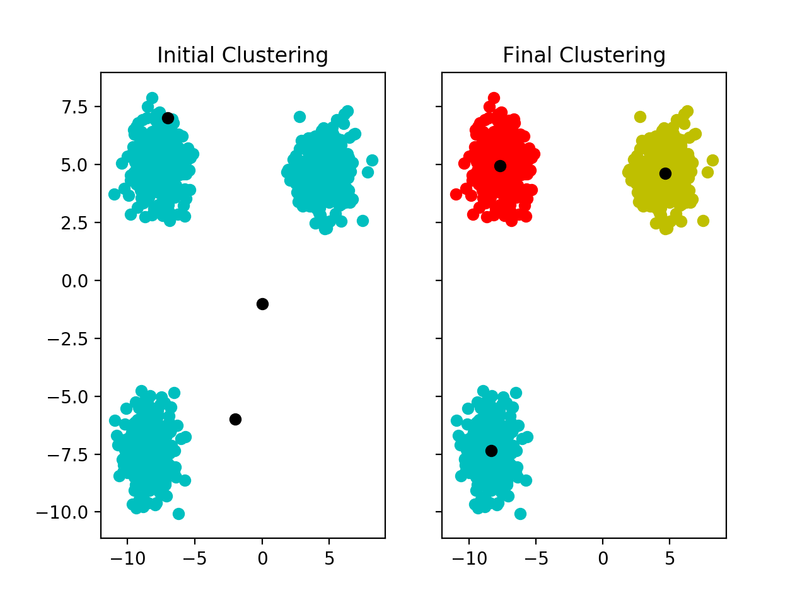

# k_means_classification

Python implementation for generation of Voronoi partitions. Data generated with scikit-learn, and algorithm compared against scikit-learn implementation. Plotted with matplotlib.

